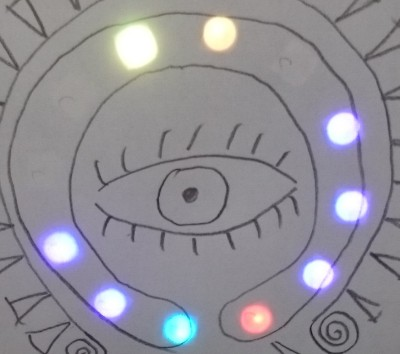

# ElBanquos_1D_pong
A 1D Pong game implemented with an arduino and neopixles

# Motivation
## Fun
I have seen multiple implementations of 1D pong and want to collect the best ideas into one game. 
* Neopixel stripe as display
* Special gimmicks (Power Pills, Labyrinths, Barriers or life)
## Software engeneering
In my other arduino projects I already startet to split up the code into **core function - input management - output management**. I wanted to use this project to give that approach a harder push. The main goals are:
* see if decoupling is really helping in a more complex application
* establish some standard patterns
* break down the logic of the core into useful peaces to
    * keep things readable (reduce the amount of "if" statement hierarchies) 
    * reduce the possibility of "interference" 
    * get a robust foundation for extending functionality

# Roadmap / Ideas
* MK1 - Initial implementation using a 12 pixel ring. The main effort will be to implement a module architecture that can be extended an modified easy with new features. The main challenge is to implement smooth movement with 16 bit integer arithmetic
* MK2 - Extending the game to a longer pixel strip (depending on the money it will cost). This will give more options for some crazy variations (Moving bonus spots, labyriths, magnets, stacking of bonus elements, movement variations)

# Log
* MK1 is complete. See 
