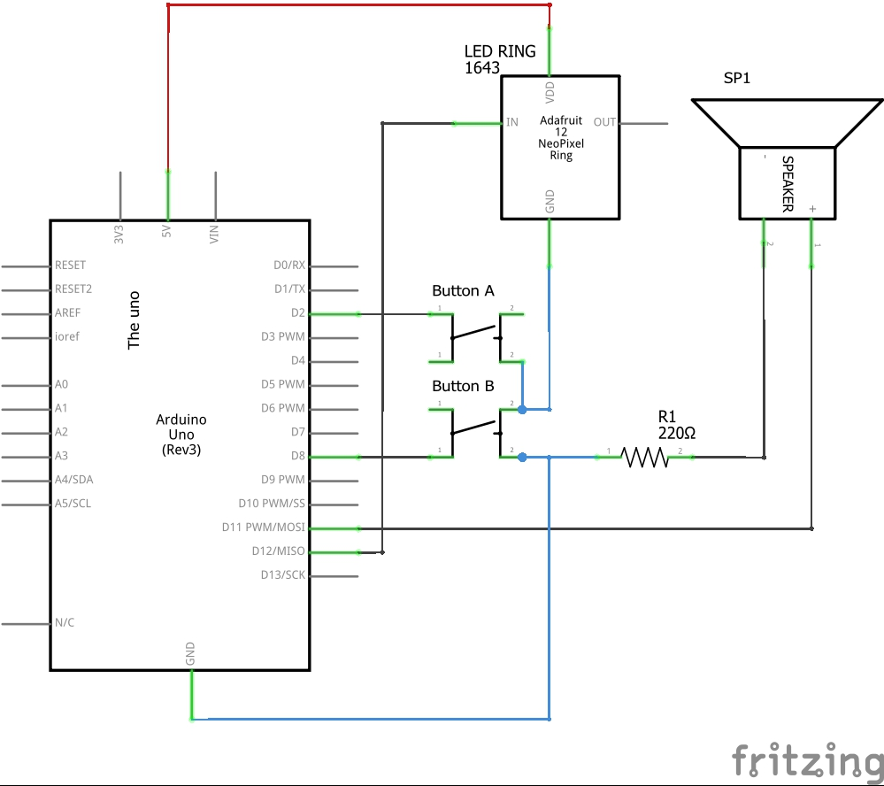

[back to readme](https://mattywausb.github.io/ElBanquos_1D_pong/)
___
# 1D Pong game MK1 

## Demo

# Components
* Arduino Uno
* small breadboard (the one from the starter kit)
* 2 Buttons
* Neopixel Ring with 12 pixels
* Resistor 220 Ohm
* Speaker
* Bunch of jumper wires
* Cardboard, Paper

# Tools
* Arduino development platform
* cutter
* pen or pencil (for decorating)

# Wiring
See fritzing file in the reporisotry for better detail.

## Breadboard setup

## Circuit diagram

___
[back to readme](https://mattywausb.github.io/ElBanquos_1D_pong/)
